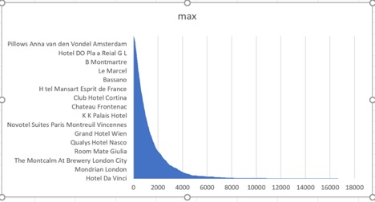
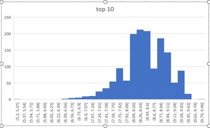
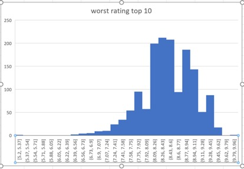
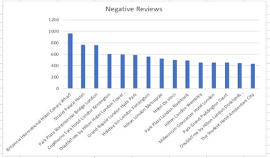
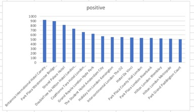
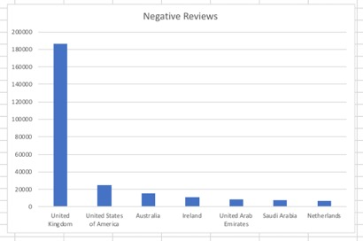
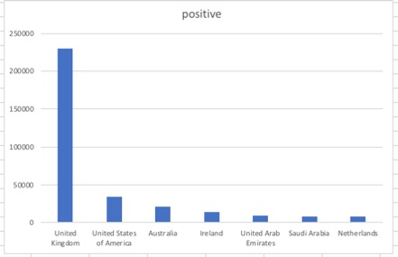
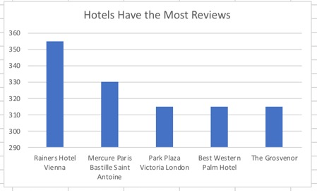

## Group-Project


Fangyuan Wan, Lareina Zou, Shiva Naicker
```
datasets.hotel_reviews
```

## Description
What does the dataset describe?
```
This dataset contains 515,000 customer reviews and scoring of 1493 luxury hotels across Europe.
Meanwhile, the geographical location of hotels is also provided for further analysis.
```

What are the columns?
```
Our dataset contains 17 columns. The description of each field is as below:
Hotel Address: Address of hotel. 
Review Date: Date when reviewer posted the corresponding review.
Average Score: Average Score of the hotel, calculated based on the latest comment in the last year.
Hotel Name: Name of Hotel
Reviewer Nationality: Nationality of Reviewer
Negative Review: Negative Review the reviewer gave to the hotel. If the reviewer does not give the negative review, then it should be: 'No Negative'
Review Total Negative Word Counts: Total number of words in the negative review.
Positive Review: Positive Review the reviewer gave to the hotel. If the reviewer does not give the negative review, then it should be: 'No Positive'
Review Total Positive Word Counts: Total number of words in the positive review.
Reviewer Score: Score the reviewer has given to the hotel, based on his/her experience
Total Number of Reviews Reviewer Has Given: Number of Reviews the reviewers has given in the past.
Total Number of Reviews: Total number of valid reviews the hotel has.
Tags: Tags reviewer gave the hotel.
Days since review: Duration between the review date and scrape date.
Additional Number of Scoring: There are also some guests who just made a scoring on the service rather than a review. This number indicates how many valid scores without review in there.
Lat: Latitude of the hotel
long: longitude of the hotel

```

## Question 1
1. Which hotel has the most reviews?
```sql
SELECT DISTINCT hotel_name,
MAX(total_number_of_reviews) as max
from datasets.hotel_reviews 
GROUP BY 1
ORDER BY max DESC
```

Hotel Da Vinci = 16670



## Question 2

2. What is the average of total negative reviews' word counts?
```sql
SELECT avg(review_total_negative_word_counts)
FROM datasets.hotel_reviews
```
18.539450263505888

## Question 3
3. What is the average of total positive reviews' word counts?
```sql
select avg(review_total_positive_word_counts) from  datasets.hotel_reviews
```
17.77645820164502

## Question 4
4.Which hotels have the top rating? Show the top 10.
```sql
SELECT hotel_name, average_score
FROM datasets.hotel_reviews 
GROUP BY hotel_name,average_score 
ORDER BY average_score DESC 
```
Hotel_name - average_score
 Ritz Paris - 9.8
 Hotel The Serras - 9.6
 H tel de La Tamise Esprit de France - 9.6
 Haymarket Hotel - 9.6
 41 - 9.6
 H10 Casa Mimosa 4 Sup - 9.6
 Hotel Casa Camper - 9.6
 Taj 51 Buckingham Gate Suites and Residences - 9.5
 Ham Yard Hotel - 9.5



## Question 5

5.Which hotels have the worst rating? Show the top 10.
```sql
SELECT hotel_name, average_score 
FROM datasets.hotel_reviews 
GROUP BY hotel_name,average_score
ORDER BY average_score ASC
```
hotel_name,average_score ORDER BY average_score ASC
Hotel_name - average_score
Hotel Liberty - 5.2
Hotel Cavendish - 6.4
Savoy Hotel Amsterdam - 6.4
The Tophams Hotel - 6.6
Best Western Maitrise Hotel Edgware Road - 6.6
Commodore Hotel - 6.7
Ibis Styles Milano Palmanova - 6.7
Bloomsbury Palace Hotel - 6.8
Villa Eugenie - 6.8
Gainsborough Hotel - 6.9



## Question 6

6.Which hotels had the most negative reviews in the summertime (June-Aug)? Show top 10.
```sql
SELECT hotel_name, 
COUNT(negative_review) as negative 
FROM datasets.hotel_reviews 
WHERE NOT negative_review= 'No Negative' AND review_date BETWEEN '6/1/17' AND '8/31/17'
GROUP BY hotel_name
ORDER BY negative DESC
LIMIT 15
```
Hotel_name - negative
Britannia International Hotel Canary Wharf - 964
Strand Palace Hotel - 764
Park Plaza Westminster Bridge London - 760
Copthorne Tara Hotel London Kensington - 602
DoubleTree by Hilton Hotel London Tower of London - 596
Grand Royale London Hyde Park - 586
Holiday Inn London Kensington - 564
Hilton London Metropole - 525
Hotel Da Vinci - 499
Park Plaza London Riverbank - 489



## Question 7

7.Which hotels had the most positive reviews in the summertime (June-Aug)? Show top 10.
```sql
SELECT hotel_name,
COUNT(positive_review) as positive 
FROM datasets.hotel_reviews 
WHERE NOT positive_review= 'No Positive' AND review_date BETWEEN '6/1/17' AND '8/31/17'
GROUP BY hotel_name
ORDER BY positive DESC
LIMIT 15
```
Hotel_name - positive

Britannia International Hotel Canary Wharf - 925
Park Plaza Westminster Bridge London - 895
Strand Palace Hotel - 818
DoubleTree by Hilton Hotel London Tower of London - 730
Copthorne Tara Hotel London Kensington - 658
Grand Royale London Hyde Park - 623
The Student Hotel Amsterdam City - 568
Holiday Inn London Kensington - 553
Intercontinental London The O2 - 548
Hotel Da Vinci - 539



## Question 8

8.Which countries left the most negative reviews?
```sql
SELECT reviewer_nationality,count(negative_review)
as negative
FROM datasets.hotel_reviews
where NOT negative_review='No Negative'  
GROUP BY reviewer_nationality
order by  negative desc
```
reviewer_nationality
negative
United Kingdom
186272
United States of America
25087
Australia
15451
Ireland
11149
United Arab Emirates
8227
Saudi Arabia
7468
Netherlands
6725
 


## Question 9

 9.Which countries left the most positive reviews?
```sql
SELECT reviewer_nationality,count(positive_review)
as positive
FROM datasets.hotel_reviews
where NOT  positive_review = 'No Positive'
GROUP BY reviewer_nationality
order by  positive desc
```
reviewer_nationality
positive
United Kingdom
229515
United States of America
33525
Australia
20716
Ireland
13770
United Arab Emirates
9468
Saudi Arabia
8178
Netherlands
8177



## Question 10

10.Which hotels get the most reviews that a particular reviewer has given?
```sql
SELECT hotel_name,MAX(total_number_of_reviews_reviewer_has_given) max
FROM datasets.hotel_reviews
GROUP BY hotel_name
order by max DESC
LIMIT 5
```
hotel_name
max
Rainers Hotel Vienna
355
Mercure Paris Bastille Saint Antoine
330
Park Plaza Victoria London
315
Best Western Palm Hotel
315
The Grosvenor
315




## Story
Story Overview:

If we were to be part of an investment company that invests in hotels, we would be able to use our data to narrow in on some of the best hotels. Our data tells us which hotels would be the best to invest in at the right time as well. We see this from the different reviews that each hotel is given, whether positive or negative, along with what time of the year they are given to the hotel. We also gathered data about the ratings as well which can aid us in making decisions whether we would nvest in certain hotels or not and in what time we should do so.
