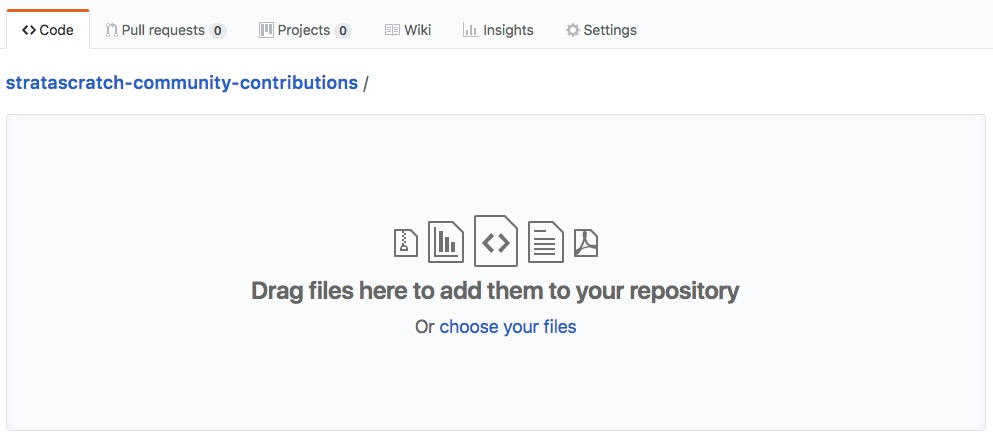
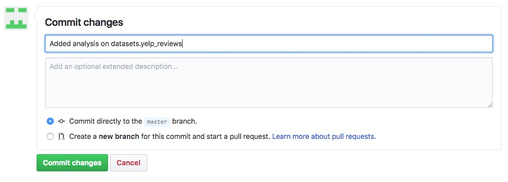
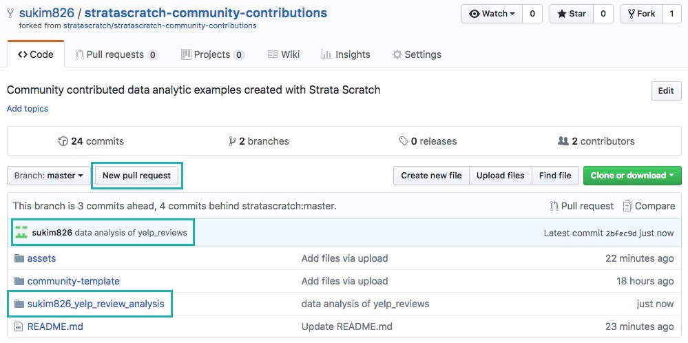
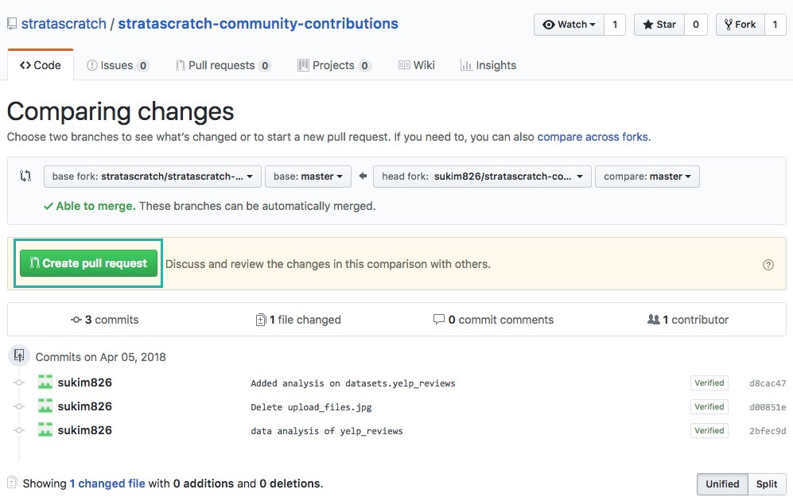
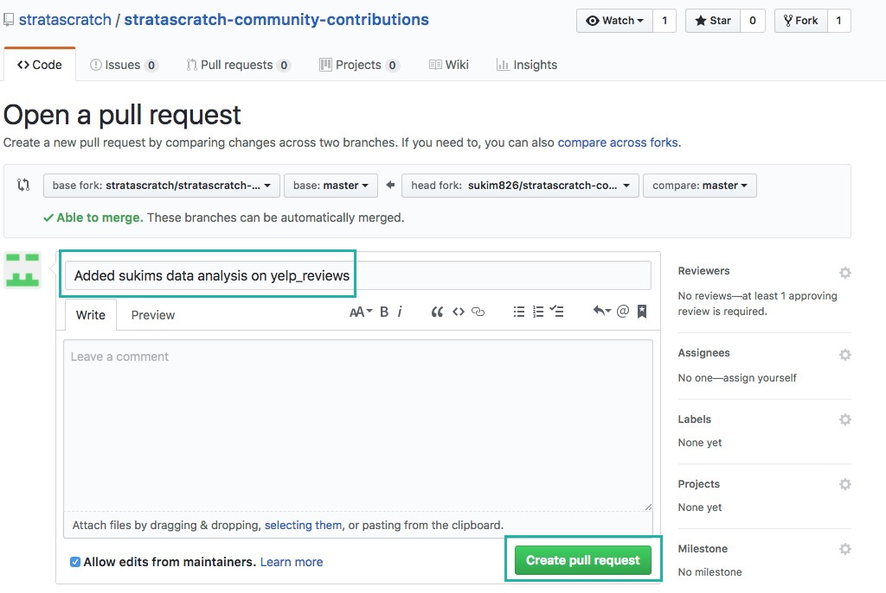
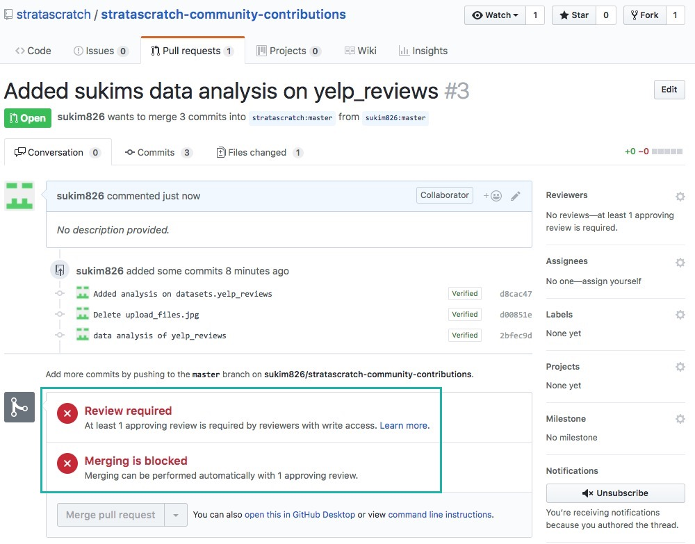

 

# Community Contributed Data Analytics Examples
This repository stores community contributed data analytic examples created with Strata Scratch. Feel free to take a look around at what others are doing with our datasets. If you have some analyses and would like to contribute use our [community-template](https://github.com/stratascratch/community-contributions/tree/master/community-template) and upload your analyses to this repository. 

## Instructions on How to Contribute to the Community

1. Navigate to the [stratascratch-community-contributions repository](https://github.com/stratascratch/stratascratch-community-contributions) and `Fork` the repo
 

2. If this is your first time forking our repo, you'll see this graphic
 

3. Once the repo has been successfully forked, you should see your GitHub `username` and `stratascratch-community-contributions` at the top left hand corner with the message `forked from stratascratch/stratascratch-community-contributions` below it.
When you're ready, you can upload your files by clicking on `Upload files`
 

4. Upload your folder that contains the data analyses you want to contribute. Remember to visit our [community-template](https://github.com/stratascratch/community-contributions/tree/master/community-template) to make sure your folder is structured properly and in accordance to our community rules.
 

5. At the bottom of the page, type a short message about what you are contributing to the repository and press `Commit changes`.
 

6. Once you commit your changes, you'll see your commit message and contribution folder in the repo. Click on `New pull request` to submit your contribution to the Strata Scratch admins.
 

7. Click on `Create pull request` to finalize your contribution to the repo.
 

8. Add a message about your pull request and click on `Create pull request`
 

9. You'll see a message that says `Review Required`. The admins will review your contribution and accept it if it meets the rules laid out in our [community-template](https://github.com/stratascratch/community-contributions/tree/master/community-template)
 

Questions? Comments? Feel free to email us at team@stratascratch.com
